# Crammy: AI-Powered Study Companion

<p align="center">
  
</p>

Crammy is a Flutter mobile application designed to help students quickly convert their study materials into clear, easy-to-read notes. This project was created as my **Endterm Requirement** for the course **Application Development and Emerging Technologies ** at **Pangasinan State University - Urdaneta City Campus (PSU-Urdaneta)**.

---

## 📖 About

Crammy leverages AI to extract and summarize content from files such as PDFs, DOCX, and images (JPG, PNG). Students can upload their notes, and the app will automatically extract text, summarize it into well-structured highlights, and organize the content into student-friendly study notes for cramming. 

Beyond summarization, Crammy enhances learning with interactive tools:
- **Mnemonics**: Automatically generated to aid memory.
- **Flashcards**: Created from extracted and summarized text.
- **Quizzes**: Generated in multiple formats (Multiple Choice, True/False, Identification) from study materials.

The app features a simple, intuitive interface supporting multiple file formats and smooth navigation, making studying more efficient, engaging, and effective.

---

## ✨ Features

### 🏠 Home & File Management
- Upload study materials (PDF, DOCX, JPG, PNG)
- View and manage all uploaded files
- Delete files as needed

### 📄 Text Extraction & Summarization
- Extracts text from images and documents using OCR
- Summarizes content into concise, organized study notes
- Highlights key concepts and sections

### 🧠 Mnemonics & Flashcards
- Generates mnemonics and flashcards from summarized notes
- Interactive review tools for efficient studying

### 📝 Quiz Generation
- Creates quizzes (Multiple Choice, True/False, Identification) from study content
- Supports self-assessment and active recall

### � Camera Integration
- Built-in camera for document scanning
- Real-time text extraction from captured images
- Direct integration with AI processing pipeline

### 🔐 Security Features
- Secure API key management with environment variables
- No hardcoded secrets in source code
- Safe for version control and collaboration

### 🚀 User Experience
- Simple, student-friendly interface
- Fast processing and summarization
- Smooth navigation between features
- Onboarding screens for first-time users

---

## 🛠️ Technologies Used

| Technology         | Purpose                                      |
|-------------------|----------------------------------------------|
| **Flutter**       | Cross-platform mobile framework               |
| **Dart**          | Programming language                         |
| **Google Generative AI** | Text summarization and quiz generation |
| **flutter_dotenv**| Secure API key management                    |
| **file_picker**   | File selection from device                   |
| **docx_to_text**  | DOCX file text extraction                    |
| **sqflite**       | Local database for storing files/quizzes     |
| **shared_preferences** | Storing onboarding state                |
| **camera**        | Camera functionality for document scanning   |

---

## 📁 Project Structure

```
crammy_app/
├── .env                              # Environment variables (not in git)
├── .env.example                      # Environment template
├── .gitignore                        # Git ignore file
├── ENV_SETUP.md                      # Environment setup guide
├── pubspec.yaml                      # Dependencies and configuration
├── README.md                         # Project documentation
├── analysis_options.yaml            # Dart analysis options
├── android/                          # Android platform code
├── assets/
│   ├── images/                       # App icons and images
│   └── svg/                          # SVG assets
├── lib/
│   ├── main.dart                     # App entry point
│   ├── onboarding_screen.dart        # Onboarding flow
│   ├── file_processor_service.dart   # File processing logic
│   ├── quiz_generation_service.dart  # AI quiz generation
│   ├── helpers/
│   │   ├── crammy_db_helper.dart     # Database helper
│   │   └── environment_config.dart   # Environment management
│   ├── models/
│   │   ├── file_data.dart            # File data model
│   │   ├── flashcard_item.dart       # Flashcard model
│   │   ├── mnemonics_item.dart       # Mnemonics model
│   │   ├── quiz_item.dart            # Quiz model
│   │   └── quiz_statistics.dart      # Quiz statistics model
│   └── screens/
│       ├── container_home+learn/     # Main container screens
│       ├── header_humburger/         # Header navigation
│       ├── home_screen_overall/      # Home screen components
│       └── learn_screen_overall/     # Learning screens
├── test/
│   └── widget_test.dart              # Widget tests
└── web/                              # Web platform support
```

---

## 🚀 Getting Started

### Prerequisites
- Flutter SDK (>=3.2.0 <4.0.0)
- Dart SDK
- Android Studio / VS Code with Flutter extensions
- Gemini AI API key from [Google AI Studio](https://makersuite.google.com/app/apikey)

### Installation

1. Clone the repository:
	```bash
	git clone https://github.com/<your-username>/crammy_app.git
	```
2. Navigate to the project directory:
	```bash
	cd crammy_app
	```
3. Set up environment variables:
	```bash
	cp .env.example .env
	```
	Then edit `.env` and add your Gemini API key:
	```env
	GEMINI_API_KEY=your_actual_api_key_here
	```

4. Install dependencies:
	```bash
	flutter pub get
	```
5. Run the app:
	```bash
	flutter run
	```

### Environment Setup

For detailed environment setup instructions, see [ENV_SETUP.md](ENV_SETUP.md).

---

## 🎯 Target Users
- Students who want to study efficiently
- Learners who need quick summaries and interactive tools
- Anyone who wants to convert study materials into organized notes

---

## 💡 Novelty & Importance
Crammy transforms ordinary study materials into interactive, bite-sized knowledge. It saves time, reduces stress, and makes cramming more effective by:
- Extracting and summarizing content from various file types
- Generating mnemonics, flashcards, and quizzes automatically
- Organizing study notes for easy review

---

## 📸 Screenshots

<p align="center">
	
	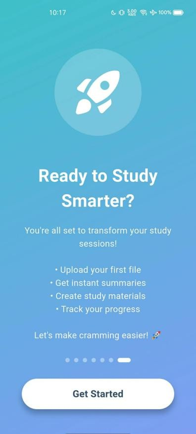
	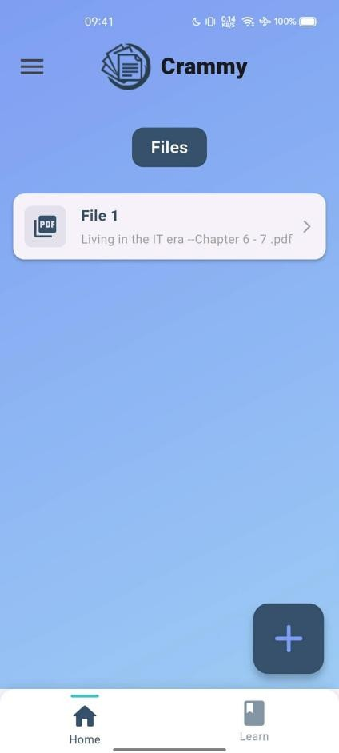
	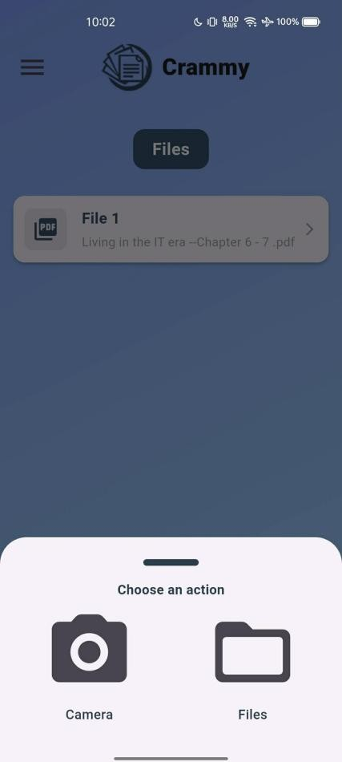
	
	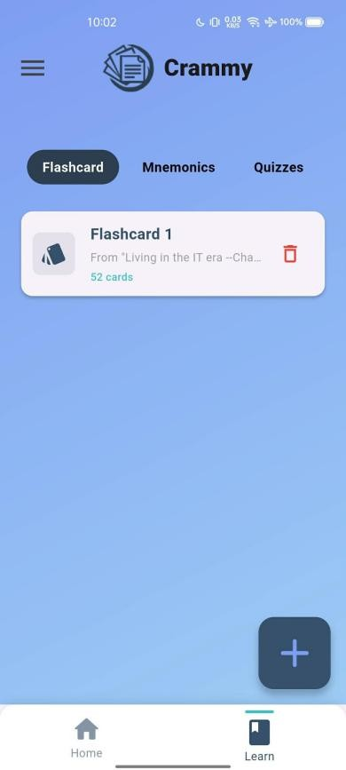
	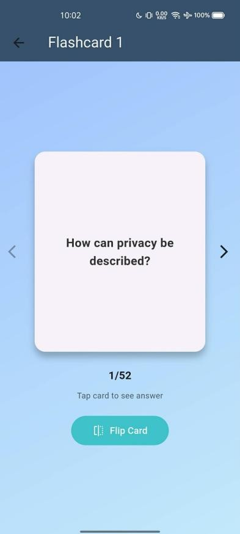
	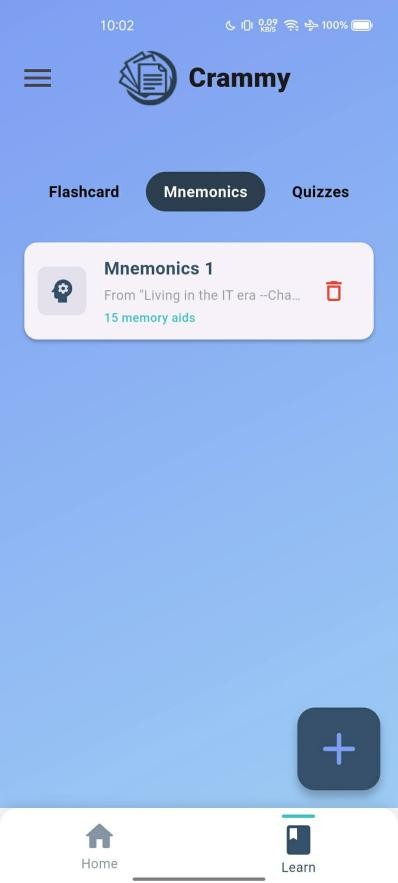
	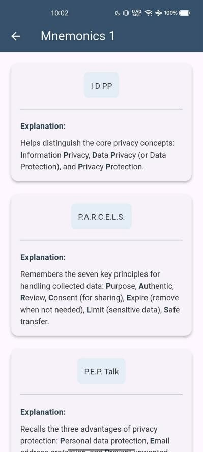
	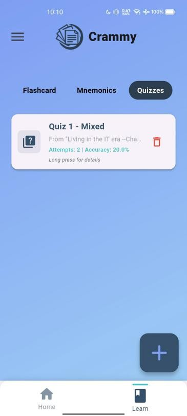
	
	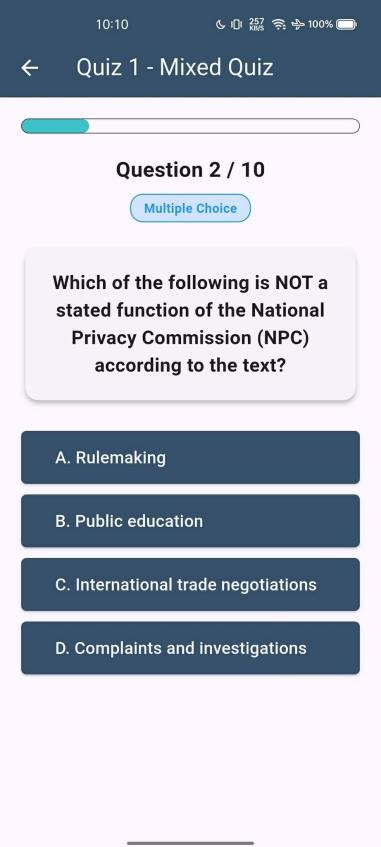
	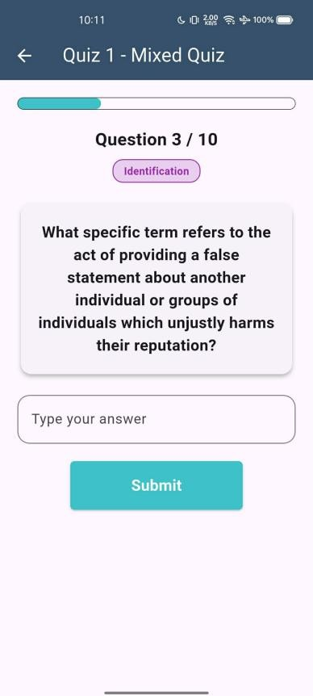
	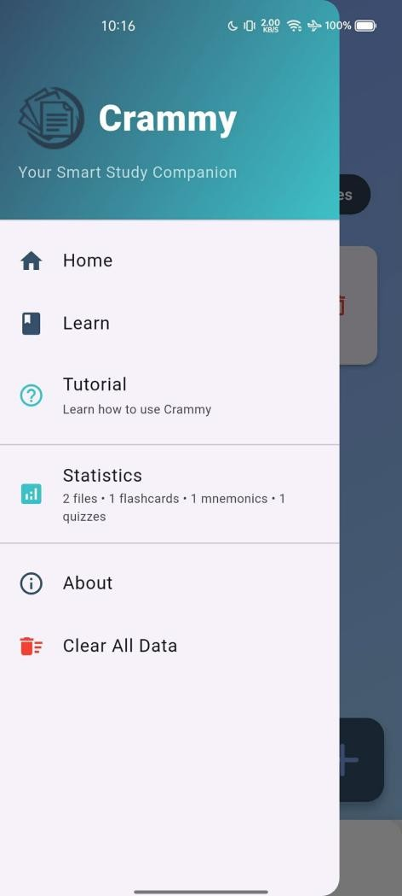
</p>

---

## 👨‍💻 Developer

**Eljohn Molina**  
Application Development and Emerging Technologies 	 
Pangasinan State University - Urdaneta City Campus

---

## 📄 License

This project is created for educational purposes as part of academic requirements.

---

<p align="center">
  <i>"Turn your study materials into organized, bite-sized knowledge."</i>
</p>
